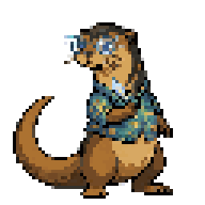

<p align="center">
  
</p>

<h1 align="center">Opéndex</h1>

<p align="center"><strong>Take a photo. Get a creature.</strong></p>

<p align="center">
  
  
  
</p>

---

Opéndex turns your phone camera into a creature generator. Snap a photo of anything -- your cat, a houseplant, the sandwich on your desk -- and Gemini AI creates a unique pixel-art creature with stats, types, moves, and a walking sprite sheet. Everything runs on-device through the Gemini API. No backend, no account, just your camera and your imagination.

---

## Example

<p align="center">
  
  <strong style="font-size: 48px; vertical-align: middle; margin: 0 24px;">&#8594;</strong>
  
</p>

<p align="center"><em>Octolume, a Water / Light type, generated from a photo of a toy octopus.</em></p>

---

## Screenshots

<p align="center">
  
  
  
</p>

---

## Features

- **Instant creature generation** -- Take a photo, tap capture, and watch the Pokédex-style opening animation
- **AI-powered stats** -- Each creature gets a name, dual types, HP/Attack/Defense/Speed, and flavor text
- **4-frame sprite sheet** -- Walking animation in crisp pixel art via Gemini image generation
- **Gen 1 style moves** -- 4 moves auto-assigned based on creature types (STAB, coverage, and status)
- **Retro Pokédex UI** -- D-pad navigation, LCD screen styling, and pixel-perfect VT323 typography
- **Persistent library** -- Your creature collection stays on-device between sessions
- **Creature release** -- Delete creatures you no longer want
- **Zero backend** -- All generation runs through the Gemini API from your phone

---

## More Creatures

<p align="center">
  
  
</p>

<p align="center"><em>Ichthyosavant (Nature / Arcane) and Rubytrunk (Earth / Arcane)</em></p>

---

## Download

| Platform | Link |
|----------|------|
| Android  | [app-release.apk](https://github.com/matifema/opendex/releases/latest/download/app-release.apk) |

Scan the QR code or tap the link above to download the latest APK directly to your Android device.

> iOS is not yet supported due to Gemini image generation limitations on the SDK version used.

---

## How It Works

```
[Camera] --> [Gemini Text] --> [Creature Spec]
                 |
                 +-> Name, Types, Stats, Flavor Text
                 +-> Visual description + palette
                              |
                              v
                       [Gemini Image]
                              |
                              +-> 256x64 sprite sheet (4 frames)
                              |
                              v
                       [Post-Processing]
                              |
                              +-> White-to-transparent conversion
                              +-> Nearest-neighbor resize
                              |
                              v
                       [Move Database]
                              |
                              +-> 4 moves based on types
```

The app sends your photo to `gemini-2.5-flash-lite-preview` which returns a JSON creature spec. That spec is then sent to `gemini-2.5-flash-image-preview` to generate the pixel art. The raw sprite goes through chrominance-aware alpha masking and nearest-neighbor resize to produce crisp transparent PNGs.

---

## Contributing

### Prerequisites

- [Flutter SDK](https://docs.flutter.dev/get-started/install) 3.4 or later
- Android SDK (for Android builds) or Xcode (iOS, currently limited support)
- A [Gemini API key](https://aistudio.google.com/apikey)

### Setup

```bash
git clone https://github.com/matifema/pokedex.git
cd pokedex/OpénDex
flutter pub get
```

### Run (debug)

```bash
flutter run --dart-define=GEMINI_API_KEY=your_key_here
```

You can also enter the API key inside the app's Settings screen.

### Build (release APK)

```bash
flutter build apk --release --dart-define=GEMINI_API_KEY=your_key_here
```

The APK is output to `build/app/outputs/flutter-apk/app-release.apk`.

### Project structure

```
OpénDex/lib/
  config.dart                  -- API key from dart-define
  main.dart                    -- App entry point, theming
  models/                      -- Creature, Stats, Move data classes
  pages/
    home_page.dart             -- Camera, generation flow, navigation
    settings_page.dart         -- API key input and preferences
  services/
    ai/
      gemini_service.dart      -- Gemini API client (analysis + image gen)
      image_processor.dart     -- White-to-transparent + resize pipeline
      move_database.dart       -- Gen 1 move pool with type-based selection
    storage/                   -- SharedPreferences, file-based persistence
  widgets/
    home/
      pokedex_screen.dart      -- LCD display with creature stats and sprite
      pokedex_header.dart      -- Title bar and species counter
      control_panel.dart       -- Capture button and D-pad
    capture_animation.dart     -- Pokeball spinner during generation
    dex_open_animation.dart    -- Mechanical opening animation
```

### Architecture notes

The generation pipeline is stateless: each photo triggers a fresh Gemini call. The only state stored locally is the creature library (serialized as JSON via `shared_preferences` and sprite sheets saved as PNG files). The API key is also stored in `shared_preferences` if entered through Settings.

The image generation uses raw HTTP (not the SDK) because the `google_generative_ai` 0.4.7 SDK cannot parse `inlineData` parts in model responses. The HTTP client handles both the analysis and image endpoints, with one automatic retry on transient failures.

### Dependencies

| Package | Purpose |
|---------|---------|
| `google_generative_ai` ^0.4.7 | Gemini text generation SDK |
| `http` ^1.5.0 | Raw HTTP for Gemini image generation |
| `image` ^4.5.4 | Pixel-level image processing |
| `image_picker` ^1.1.2 | Camera and gallery access |
| `shared_preferences` ^2.2.2 | Local persistence |
| `path_provider` ^2.1.3 | File system paths |
| `google_fonts` ^6.2.1 | VT323 pixel font |

---

## Disclaimer

Opéndex is a fan-made project not affiliated with, endorsed by, or connected to The Pokémon Company, Nintendo, Game Freak, or Creatures Inc. All generated creatures are original creations. Generated assets should not be used commercially.
