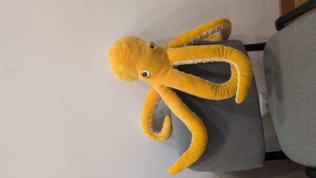
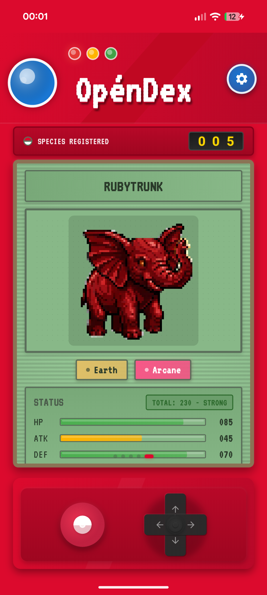
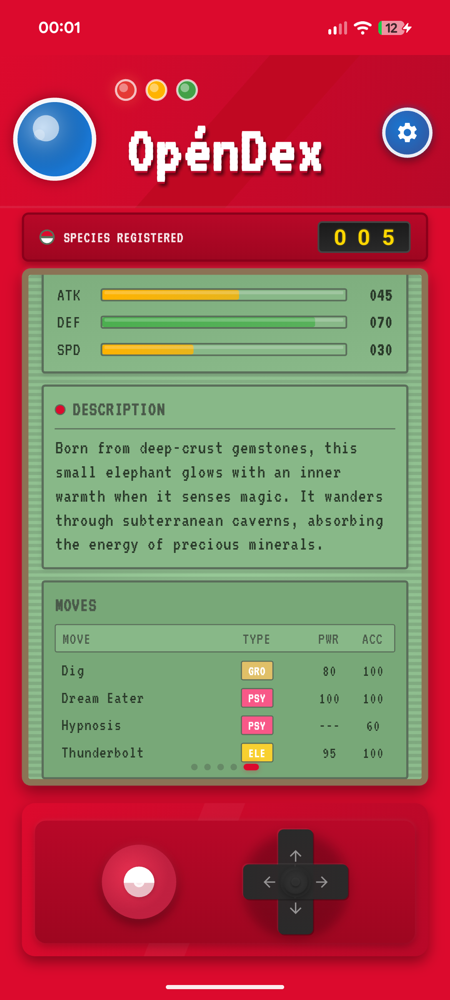
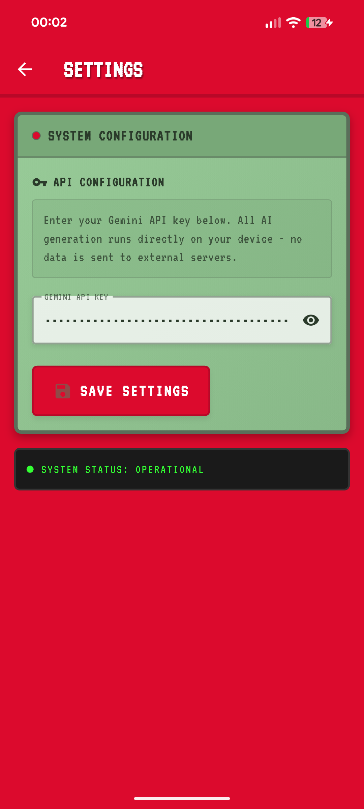

<h1 align="center">OpénDex</h1>

<strong>A Gen 1 Pokédex for whatever is in front of the camera.</strong>

  
  
  

---

Point the camera at a person, a pet, a coffee mug, or anything else and Opéndex turns it into a Gen 1-style Pokémon: name, types, stats, moves, and a walking sprite.

The animation sprites cut from a single generated image, then scaled with nearest-neighbor so they stay nice and pixelated instead of getting smoothed into mush.

There is no account and no backend. The phone talks to the Gemini API and stores the collection locally.
Get a Gemini api key [here](https://aistudio.google.com/api-keys).

---

## Example

<table align="center">
  <tr>
    <td align="center" width="220">
      <strong>Original photo</strong> 
      
    </td>
    <td align="center" width="100" valign="middle">
      <strong style="font-size: 48px;">&#8594;</strong>
    </td>
    <td align="center" width="280">
      <strong>Generated creature</strong> 
      
    </td>
  </tr>
</table>

<em>Octolume, a Water / Light type, generated from a photo of a toy octopus.</em>

---

## Screenshots

  
  
  

---

## Download

| Platform | Link |
|----------|------|
| Android  | [app-release.apk](https://github.com/matifema/opendex/releases/latest/download/app-release.apk) |

Scan the QR code or tap the link above to download the latest APK directly to your Android device.

> iOS is not yet supported due to the fact that i dont have an iphone.
---

### Cost per creature

Pricing based on [Google Gemini API](https://ai.google.dev/gemini-api/docs/pricing) (June 2026).

| Step | Model | Input tokens | Output tokens | Free tier | Paid tier |
|------|-------|-------------|---------------|-----------|-----------|
| Analysis | `gemini-3.1-flash-lite` | ~2,200 text + ~260 image | ~600 JSON | $0 | ~$0.0015 |
| Sprite sheet | `gemini-3.1-flash-image` | ~3,000 text | ~200 image | -- | ~$0.0135 |
| **Total** | | | | **~$0.012** | **~$0.015** |

## Disclaimer

Opéndex is a fan-made project not affiliated with, endorsed by, or connected to The Pokémon Company, Nintendo, Game Freak, or Creatures Inc. All generated creatures are original creations. Generated assets should not be used commercially.
